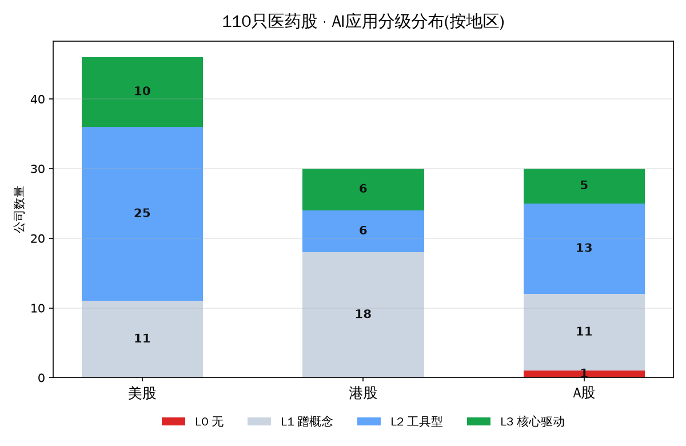
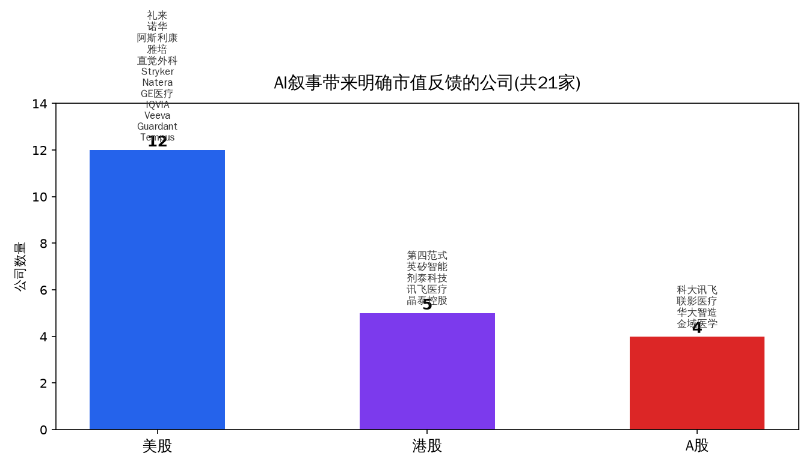
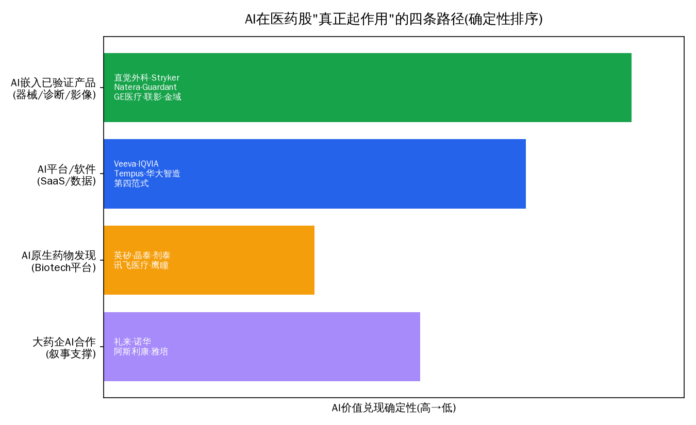

# 三地区医药股 × AI应用全样本研究（美股50 + 港股30 + A股30 ≈ 110只）

> 报告日期：2026-06-16｜数据为2026年6月近期快照｜配套《医药AI》系列
>
> **口径**：聚焦"AI相关医药子行业"（创新药/Biotech + CXO/CRO + 器械/诊断/AI医疗），排除保险/流通/医院。按当前市值取近期快照排名。**市值随股价每日波动、网络抓取易有单位错乱，名次为"档位"非精确座次（允许±2-3位、市值±10%误差）**，正式决策请以交易所/Wind实时复核。实际整理106只（去重后），美股46/港股30/A股30。

## AI价值分级框架（贯穿全表）
- **L0** 无AI ｜ **L1** 蹭概念（仅PR提及无落地）｜ **L2** 工具型（AI用于内部研发提效/AI影像/AI诊断辅助，非估值核心）｜ **L3** 核心驱动（AI是产品或管线核心，且有数据/BD/获批/商业化背书）
- **AI市值反馈**：有 / 不明 / 无（能否找到"AI催化剂→股价或估值溢价"的明确对应）

---

## 一、直接回答你的核心问题

**问：哪些医药公司借助AI发展、并且AI真正起了作用（含市值反馈）？**

**结论：106只中，AI达"核心驱动(L3)"21家、"工具型(L2)"44家；其中AI叙事带来明确市值反馈的共21家。但最关键的发现是——AI真正"起作用且被市值认可"的，主要不是烧钱的AI原生药物发现初创，而是「AI嵌入已验证产品」和「AI软件/数据平台」两类。**

### AI"真正起作用"的四条路径（按价值兑现确定性排序）

**🟢 路径1 · AI嵌入已验证产品（确定性最高：有真实营收 + 市值溢价）**
- **直觉外科 ISRG**（$144B）：da Vinci 5搭载AI，AI手术分析/培训是估值溢价核心。
- **Stryker SYK**（$119B）：Mako AI手术机器人是核心增长引擎，连续多年双位数增长。
- **GE医疗 GEHC**（$30B）：FDA AI授权数~120项**全行业第一**，AI是影像差异化核心。
- **Natera NTRA**（$32B）：Signatera MRD用多模态AI（30万例库）做风险分层，量价齐升。
- **Guardant GH**（$17B）：AI/ML驱动ctDNA液体活检与Shield早筛，AI早筛叙事推动反弹。
- **雅培 ABT**（$159B）：Libre Assist（AI预测血糖）+ 拟收购Exact Sciences入局癌症诊断。
- **联影医疗 688271**（~920亿元）：uAI智能影像全链路，2025扣非+77%，AI是国产高端影像的溢价来源。
- **华大智造 688114 / 金域医学 603882**：测序+AI、AI病理大模型——属国产"AI赋能诊断"，市值反馈温和但方向确立。

**🔵 路径2 · AI软件/数据平台（商业模式清晰、可规模化）**
- **Veeva VEEV**（$25B）：Veeva AI Agents（基于Anthropic/Bedrock）跨全模块落地，为药企SaaS再加成。
- **IQVIA IQV**（$29B）：IQVIA.ai联手NVIDIA + 100余项联合AI专利 + Agentic平台，重塑CRO+数据叙事。
- **Tempus AI TEM**（$9B）：纯AI医疗旗舰，多模态肿瘤数据库+算法，数据授权NRR 126%，**市值高度由AI预期定价**。
- **第四范式 6682**（~218亿港元）：企业级AI平台（医疗为重点应用场景之一），AI是主估值逻辑。

**🟠 路径3 · AI原生药物发现Biotech（AI叙事最纯，但市值反馈高波动、未被基本面坐实）**
- **英矽智能 3696 / 晶泰控股 2228 / 剂泰科技 7666**："AI制药三小龙"，AI是核心估值——但晶泰从约$80亿高点回落、剂泰首日暴涨后承压、英矽仍亏损。
- **讯飞医疗 2506**：医疗大模型第一股，政策催化。
- **⚠️ 反例 · 鹰瞳科技 2251**：AI眼底诊断"第一股"，但**AI概念不抵商业化现实，长期破发**——这是"AI叙事≠市值兑现"的警示样本。

**🟣 路径4 · 大药企AI合作（叙事加分项，非股价主驱动）**
- **礼来 LLY**（~$1万亿）：TuneLab AI平台 + 与Isomorphic合作——但股价真正驱动是GLP-1减重药，AI是外溢叙事。
- **诺华 NVS / 阿斯利康 AZN**：诺华与Isomorphic近$30亿旗舰合作；AZN收购Modella AI + NVIDIA/IonQ量子药物发现，称靶点设计提速>50%。AI是估值叙事支点之一，但非主驱动。

### 给你的优化建议（针对"找AI真正创造价值的医药公司"这个目的）
1. **最高确定性标的在路径1+2**：AI赋能的**手术机器人/AI诊断/医学影像（ISRG、SYK、GEHC、Natera、Guardant、联影）**与**医药AI软件平台（Veeva、IQVIA、Tempus）**——它们AI落地有真实营收支撑，市值也给了正反馈。
2. **路径3（AI原生药物发现）是"高赔率高风险"**：AI叙事最性感，但目前市值与基本面背离最大、回撤最剧烈（详见《市场规模预测》篇P/S≈35×的背离分析）。适合作卫星仓而非核心仓。
3. **路径4不要为"AI"买大药企**：礼来/诺华/AZN的股价由主营管线决定，AI只是边际加分，不构成独立投资理由。
4. **警惕纯AI概念股**：鹰瞳、万东医疗等"AI医疗概念"在缺乏规模化营收时长期跑输——**AI分级要看L3是否带"商业化/获批/数据"背书**，而非PR话术。

---

## 二、110只全样本数据表（三地区）

> 完整可筛选版见随附 **`AI医药110股_数据表.xlsx`/`.csv`**（含按AI分级配色、自动筛选）。下表为同一数据源。

### 美股 · AI相关医药 市值前46(快照2026-06,USD)

| 排名 | 代码 | 公司 | 市值 | 细分 | 阶段 | 代表产品 | 营收 | 净利润 | 市场判断 | AI | AI应用 | AI反馈 |
|---|---|---|---|---|---|---|---|---|---|---|---|---|
| 1 | LLY | 礼来 | ~$1.0万亿 | 大药企/GLP-1 | 成熟 | Zepbound/Mounjaro | $65.2B(FY25) | $20.6B | GLP-1龙头,全球药企市值第一 | L2 | TuneLab AI平台+与Isomorphic合作(~$30亿里程碑) | 有 |
| 2 | JNJ | 强生 | ~$567B | 大药企+器械 | 成熟 | Darzalex/Stelara | $94.2B | $26.8B | 多元化巨头,防御性强 | L2 | AI分子结合预测+AI手术辅助 | 不明 |
| 3 | ABBV | 艾伯维 | ~$375B | 大药企 | 成熟 | Skyrizi/Rinvoq | $61.2B | $4.2B | 双新药接棒Humira成功 | L1 | 主要靠BD,内部AI披露少 | 无 |
| 4 | MRK | 默克 | ~$294B | 大药企 | 成熟 | Keytruda/Gardasil | $64.5B | $17.1B | K药依赖高,面临专利悬崖 | L2 | AI卓越中心,靶点筛选试点 | 无 |
| 5 | NVS | 诺华 | ~$291B | 大药企 | 成熟 | Entresto/Cosentyx | ~$52B | 未披露 | 专注创新药,管线稳健 | L3 | 与Isomorphic旗舰合作(近$30亿,扩至3项目) | 有 |
| 6 | AZN | 阿斯利康 | ~$284B | 大药企/肿瘤 | 成熟 | Tagrisso/Imfinzi | $58.7B | $10.2B | 肿瘤管线深厚,AI布局激进 | L3 | 收购Modella AI+NVIDIA/IonQ量子,靶点设计提速>50% | 有 |
| 7 | AMGN | 安进 | ~$185B | Biotech | 成熟 | Repatha/MariTide(在研减重) | $36.8B | $7.7B | 减重药MariTide关键催化 | L2 | 与Generate Biomedicines生成式AI合作 | 不明 |
| 8 | TMO | 赛默飞 | ~$184B | 工具/CXO | 成熟 | 质谱/CDMO | $44.6B | ~$6.5B | 工具龙头,CXO触底回升 | L2 | AI图像分析(Amira)赋能客户 | 无 |
| 9 | NVO | 诺和诺德 | ~$170B | 大药企/GLP-1 | 成熟 | Ozempic/Wegovy | $46.8B | ~$15.2B | GLP-1竞争加剧,年内大跌~39% | L1 | 内部研发AI,披露少 | 无 |
| 10 | GILD | 吉利德 | ~$163B | Biotech/抗病毒 | 成熟 | Biktarvy/Yeztugo | $29.4B | $6.3B | HIV预防新药放量,估值修复 | L2 | 病毒学AI+临床试验管理 | 不明 |
| 11 | ABT | 雅培 | ~$159B | 器械/诊断 | 成熟 | FreeStyle Libre(CGM) | $44.3B | $6.5B | CGM强劲,拟购Exact入局癌症诊断 | L2 | Libre Assist(AI预测血糖)+诊断AI | 有 |
| 12 | PFE | 辉瑞 | ~$150B | 大药企 | 成熟 | Comirnaty/Eliquis | $63.6B | $8.0B | 后疫情转型,押注肿瘤/减重 | L2 | 深度学习平台BIND建模蛋白折叠 | 无 |
| 13 | ISRG | 直觉外科 | ~$144B | 器械/手术机器人 | 成熟 | da Vinci 5 | $10.1B | ~$2.9B | 手术机器人绝对龙头,高估值高增长 | L3 | da Vinci 5搭载AI,AI辅助手术/培训 | 有 |
| 14 | DHR | 丹纳赫 | ~$122B | 工具/诊断/CXO | 成熟 | Cepheid分子诊断/Leica病理 | $24.6B | $3.6B | 工具/诊断平台,业绩企稳 | L2 | 联邦式AI:Cepheid/Leica AI诊断 | 不明 |
| 15 | SYK | Stryker | ~$119B | 器械/骨科机器人 | 成熟 | Mako手术机器人 | $25.1B | $3.3B | 手术机器人放量,连续双位数增长 | L3 | Mako AI原生平台(术前CT+术中机械臂) | 有 |
| 16 | BMY | 施贵宝 | ~$117B | 大药企 | 成熟 | Opdivo/Eliquis/Cobenfy | $48.2B | $7.1B | 专利悬崖,Cobenfy新增长点 | L2 | AI预测优先级+Owkin/Schrödinger合作 | 不明 |
| 17 | VRTX | 福泰 | ~$114B | Biotech/罕见病 | 成熟 | Trikafta/Casgevy | $12.0B | 微利 | CF独家+基因疗法+非阿片镇痛 | L2 | AI药物发现基础设施+Genomics plc合作 | 不明 |
| 18 | MDT | 美敦力 | ~$108B | 器械 | 成熟 | 心律管理/GI Genius | $33.5B | $4.7B | 器械综合龙头,增长温和 | L2 | GI Genius AI结肠息肉检测(首个AI内镜) | 不明 |
| 19 | SNY | 赛诺菲 | ~$103B | 大药企/疫苗 | 成熟 | Dupixent/疫苗 | ~€41B | 未披露 | Dupixent驱动,疫苗稳健 | L1 | 宣称全AI公司愿景,落地披露有限 | 无 |
| 20 | BSX | 波士顿科学 | ~$73B | 器械/心血管 | 成熟 | Farapulse(PFA)/WATCHMAN | ~$18.5B | 未披露 | 电生理/PFA高增长 | L1 | AI影像/标测辅助,无突出AI产品 | 无 |
| 21 | REGN | 再生元 | ~$66B | Biotech | 成熟 | Eylea/Dupixent | ~$14B | 未披露 | Eylea竞争承压,估值回落 | L2 | 遗传学数据库+AI靶点发现 | 不明 |
| 22 | EW | 爱德华 | ~$47B | 器械/心脏瓣膜 | 成熟 | TAVR瓣膜 | $6.07B | ~$1.4B | 结构性心脏病龙头,TAVR稳健 | L1 | 影像/瓣膜规划辅助 | 无 |
| 23 | ARGX | argenx | ~$46B | 创新药/自免 | 商业化放量 | VYVGART | $42亿VYVGART | $13亿(首盈) | FcRn龙头,重症肌无力放量强劲 | L1 | 抗体发现工具辅助 | 无 |
| 24 | ZTS | 硕腾 | ~$45B | 动物保健 | 成熟 | Apoquel/Librela | $9.5B | $2.7B | 动保龙头,防御性现金流 | L2 | 动物诊断影像AI+研发提效 | 不明 |
| 25 | IDXX | 艾德士 | ~$44B | 诊断(动物) | 成熟 | 宠物诊断仪+耗材 | $43.0亿 | ~$10.6亿 | 宠物诊断垄断,复购模式 | L2 | AI影像/血检判读算法 | 不明 |
| 26 | ALNY | Alnylam | ~$37B | 创新药/RNAi | 商业化转盈 | Amvuttra/TTR | $37亿 | $3.1亿(首盈) | RNAi平台兑现,TTR放量 | L2 | RNAi靶点AI筛选 | 无 |
| 27 | WAT | 沃特世 | ~$35B | 工具/CXO | 成熟+并购 | 液相/质谱(并BD生科) | ~$30亿(并表前) | 未披露 | 完成与BD生科$175亿合并,规模跃升 | L2 | 仪器数据/方法AI | 不明 |
| 28 | NTRA | Natera | ~$32B | 诊断/液体活检 | 高增未盈利 | Signatera(MRD)/Panorama | $23.1亿 | -$2.1亿 | MRD龙头,Signatera量价齐升 | L3 | 多模态AI(30万例库)驱动MRD风险分层 | 有 |
| 29 | GEHC | GE医疗 | ~$30B | 影像/AI医疗 | 成熟 | CT/MRI/AIR Recon DL | $20.6B | ~$2.0B | 影像龙头,FDA AI授权数行业第一 | L3 | FDA AI授权~120项居首,深度学习重建 | 有 |
| 30 | IQV | IQVIA | ~$29B | CXO/医药数据 | 成熟 | 临床CRO+真实世界数据 | $163亿 | $13.6亿 | CRO+数据双轮,AI叙事重塑 | L3 | IQVIA.ai(联手NVIDIA)+100+联合专利+Agentic | 有 |
| 31 | DXCM | DexCom | ~$28B | 器械/CGM | 成熟 | G7连续血糖监测 | $4.66B | ~$0.8B | CGM双寡头,增长16% | L2 | 血糖预测算法/ML | 不明 |
| 32 | BIIB | 渤健 | ~$28B | 创新药/神经 | 成熟 | Leqembi(阿尔茨海默) | $98.9亿 | $15.6亿 | 老产品承压,Leqembi待验证 | L2 | 研发AI辅助 | 无 |
| 33 | RMD | ResMed | ~$27B | 器械/睡眠 | 成熟 | CPAP/呼吸机 | ~$53亿 | ~$13.7亿 | 睡眠龙头,GLP-1担忧缓和 | L2 | 数字健康/睡眠数据AI | 不明 |
| 34 | MRNA | Moderna | ~$25B | 创新药/mRNA | 收缩+管线 | COVID疫苗/mRNA平台 | $19亿 | -$28亿 | COVID滑坡,靠流感/肿瘤翻身 | L2 | mRNA序列设计AI | 不明 |
| 35 | VEEV | Veeva | ~$25B | 医药SaaS | 成熟高盈利 | Vault/CRM云 | $32.0亿 | $9.1亿 | 药企SaaS垄断,AI Agent全面铺开 | L3 | Veeva AI Agents跨全模块(Anthropic/Bedrock) | 有 |
| 36 | ILMN | Illumina | ~$25B | 工具/测序 | 成熟 | NovaSeq测序 | ~$43亿 | ~$8.5亿 | 测序龙头,竞争加剧增速放缓 | L2 | DRAGEN二级分析/变异判读AI | 不明 |
| 37 | UTHR | United Therap. | ~$24B | 创新药/PAH | 成熟+异种移植 | Tyvaso DPI | $31.8亿 | $13.4亿 | PAH现金牛+异种器官期权 | L1 | 器官制造/工程辅助 | 无 |
| 38 | MTD | 梅特勒-托利多 | ~$23B | 工具/精密仪器 | 成熟 | 实验室天平 | $40.3亿 | $8.7亿 | 高ROIC精密仪器,周期触底 | L1 | 仪器软件分析 | 无 |
| 39 | INSM | Insmed | ~$21B | 创新药/罕见呼吸 | 放量未盈利 | Arikayce/Brinsupri | $6.1亿 | -$12.8亿 | Brensocatib获批驱动 | L1 | 研发AI辅助 | 无 |
| 40 | GH | Guardant | ~$17B | 诊断/液体活检 | 高增未盈利 | Guardant360/Shield | ~$10亿 | -$2.3亿 | 液体活检+早筛Shield放量 | L3 | AI/ML驱动ctDNA检测与早筛分类 | 有 |
| 41 | NBIX | Neurocrine | ~$16B | 创新药/神经精神 | 成熟 | Ingrezza | $28.6亿 | $4.8亿 | Ingrezza现金牛+Crenessity | L1 | 研发AI辅助 | 无 |
| 42 | PODD | Insulet | ~$13B | 器械/胰岛素泵 | 成熟 | Omnipod 5 | ~$25亿 | 未披露 | Omnipod 5放量强劲 | L2 | 自动给药算法(AID) | 不明 |
| 43 | ALGN | 隐适美 | ~$12B | 器械/齿科 | 成熟 | Invisalign | ~$40亿 | 未披露 | 隐形矫正龙头,需求疲软 | L2 | iTero口扫AI/数字诊断 | 不明 |
| 44 | ICLR | ICON | ~$11B | CXO/临床CRO | 成熟 | 临床外包 | ~$80亿 | 未披露 | CRO订单承压,估值历史低位 | L2 | 临床试验AI优化/患者招募 | 不明 |
| 45 | BMRN | BioMarin | ~$10.5B | 创新药/罕见病 | 成熟 | Voxzogo | $32亿 | 未披露 | 罕见病稳健,Roctavian撤市 | L1 | 研发AI辅助 | 无 |
| 46 | TEM | Tempus AI | ~$9B | AI诊断/数据 | 高增未盈利 | 肿瘤测序+AI平台 | $13亿(+83%) | -$2.5亿 | AI医疗旗舰,市值高度由AI预期定价 | L3 | 核心即AI:多模态肿瘤库+算法,数据授权NRR126% | 有 |

### 港股 · AI相关医药 市值前30(快照2026-06,HKD;财务多为RMB)

| 排名 | 代码 | 公司 | 市值 | 细分 | 阶段 | 代表产品 | 营收 | 净利润 | 市场判断 | AI | AI应用 | AI反馈 |
|---|---|---|---|---|---|---|---|---|---|---|---|---|
| 1 | 2359 | 药明康德 | ~3000亿+ | CXO | 成熟龙头 | CRDMO/TIDES | 393亿(RMB) | 191亿 | 全球CRDMO龙头,订单近600亿 | L2 | AI辅助分子设计/合成路线 | 不明 |
| 2 | 6160 | 百济神州 | ~2336亿 | 创新药 | 商业化盈利 | 泽布替尼/替雷利珠 | 382亿(RMB) | 14.2亿(首盈) | 全球BTK龙头,首次全年盈利 | L1 | 蹭AI研发概念 | 无 |
| 3 | 2269 | 药明生物 | ~1300亿 | CXO | 成熟盈利 | 生物药CRDMO/双抗ADC | 186亿(24,RMB) | 盈利 | 生物药外包全球龙头 | L2 | AI辅助细胞株/工艺开发 | 不明 |
| 4 | 6990 | 科伦博泰 | ~1000亿 | 创新药/ADC | 商业化元年 | 芦康沙妥珠(TROP2 ADC) | 稳增 | 亏损 | ADC平台,默沙东大单背书 | L1 | 概念性 | 无 |
| 5 | 9926 | 康方生物 | ~1094亿 | 创新药/双抗 | 商业化放量 | 依沃西(PD-1/VEGF)/卡度尼利 | 未披露 | — | 双抗龙头,依沃西头对头K药 | L1 | 概念性 | 无 |
| 6 | 1177 | 中国生物制药 | ~1200亿 | 创新+仿制 | 成熟盈利 | 安罗替尼 | 318亿(RMB) | 调整后45亿 | 老牌龙头创新转型 | L1 | 蹭概念 | 无 |
| 7 | 3692 | 翰森制药 | ~1800亿 | 创新药 | 成熟盈利 | 阿美乐(三代EGFR) | 150.3亿(RMB) | 55.6亿 | 创新药占八成,兑现期 | L1 | 概念性 | 无 |
| 8 | 1801 | 信达生物 | ~1330亿 | 创新药 | 全面盈利 | 信迪利单抗/玛仕度肽(减重) | 130.4亿(RMB) | 8.1亿(首盈) | 营收破百亿首盈利,辉瑞大单 | L1 | 概念性 | 无 |
| 9 | 1093 | 石药集团 | ~830亿 | 创新+仿制 | 成熟盈利 | 恩必普;AZ185亿美元多肽大单 | ~290亿(24,RMB) | 盈利 | 老牌龙头,BD出海活跃 | L1 | 蹭概念 | 无 |
| 10 | 6682 | 第四范式 | ~218亿 | AI医疗/企业AI | 商业化 | 先知AI平台/医疗AI | 未披露 | — | 企业级AI龙头,医疗为场景之一 | L3 | AI平台是核心产品(含医疗AI) | 有 |
| 11 | 6618 | 京东健康 | ~1500亿 | 互联网医疗 | 盈利 | 在线医疗/电商/京医千询 | 千亿级(RMB) | 盈利 | 互联网医疗龙头,自营药房 | L2 | AI问诊/智能分诊 | 不明 |
| 12 | 3696 | 英矽智能 | ~197亿 | AI制药 | 临床期+BD | ISM001(IPF)/8.88亿美元BD | 仍亏损 | 亏损 | AI制药第一股,自研管线+BD | L3 | 生成式AI药物发现平台(Pharma.AI) | 有 |
| 13 | 9969 | 诺诚健华 | ~197亿 | 创新药 | 商业化 | 奥布替尼(BTK) | 增长 | — | BTK中美双报 | L1 | 概念性 | 无 |
| 14 | 9995 | 荣昌生物 | ~350亿 | 创新药/ADC | 商业化 | 维迪西妥单抗/泰它西普 | 未披露 | 仍亏损 | ADC+自免双平台,出海III期 | L1 | 概念性 | 无 |
| 15 | 2367 | 巨子生物 | ~343亿 | 器械/功能护肤 | 成熟盈利 | 可复美(重组胶原) | 55.2亿(RMB) | 19.2亿 | 重组胶原龙头,增长踩刹车 | L1 | 概念性 | 无 |
| 16 | 2196 | 复星医药 | H~342亿 | 创新药/器械 | 成熟 | 汉斯状(PD-1)/CAR-T奕凯达 | 未披露 | 盈利 | 综合性药企,转型中 | L1 | 蹭概念 | 无 |
| 17 | 2096 | 先声药业 | ~331亿 | 创新药 | 成熟盈利 | 先必新;74亿海外BD | 77.3亿(RMB) | 13.4亿(+86%) | 创新+授权双轮 | L1 | 概念性 | 无 |
| 18 | 7666 | 剂泰科技 | ~300亿+ | AI制药/递送 | 次新/临床前 | AI纳米递送(LNP/mRNA) | 微量 | 亏损 | AI药物递送第一股,资本热捧 | L3 | AI驱动制剂/递送设计 | 有 |
| 19 | 0241 | 阿里健康 | ~685亿 | 互联网医疗 | 盈利 | 医鹿/天猫医药/AI健康助手 | ~350亿(FY26,RMB) | 盈利 | 阿里系医药电商 | L2 | AI导购/智能问诊 | 不明 |
| 20 | 9688 | 再鼎医药 | ~150亿级 | 创新药 | 商业化 | 则乐;KarXT(精分III期) | 未披露 | 亏损收窄 | License-in模式,商业化拐点 | L1 | 概念性 | 无 |
| 21 | 0853 | 微创医疗 | ~177亿 | 器械 | 多业务亏损 | 瓣膜/骨科/手术机器人 | 未披露 | 亏损 | 器械平台型,分拆多子公司 | L1 | 手术机器人含AI导航 | 无 |
| 22 | 2506 | 讯飞医疗 | ~100亿 | AI医疗 | 减亏中 | 智医助理/AI辅诊/影像 | 7.3亿(24,RMB) | 2025H1减亏 | 国产AI医疗,政策受益 | L3 | AI辅助诊断/电子病历是核心 | 有 |
| 23 | 6699 | 时代天使 | ~101亿 | 器械/正畸 | 盈利 | 隐形正畸矫治器 | 3.7亿美元(+38%) | 盈利 | 隐形正畸国产龙头,出海 | L2 | AI排牙/正畸方案 | 不明 |
| 24 | 2273 | 固生堂 | ~70亿 | 中医服务 | 盈利 | 中医医疗连锁 | 增长 | 盈利 | 中医服务龙头,并购扩张 | L1 | 概念性(AI中医) | 无 |
| 25 | 9966 | 康宁杰瑞 | ~64亿 | 创新药/双抗 | 临床为主 | KN046/KN026 | 未披露 | 亏损 | 双抗平台,商业化待证 | L1 | 概念性 | 无 |
| 26 | 1877 | 君实生物 | ~38亿(H) | 创新药 | 商业化 | 特瑞普利(拓益,FDA获批) | 未披露 | 亏损 | PD-1出海先行者 | L1 | 概念性 | 无 |
| 27 | 2228 | 晶泰控股 | ~200-250亿 | AI制药/材料 | 首次年度盈利 | AI+机器人药物研发平台 | 8.0亿(25,RMB,扭亏) | 首次盈利1.35亿 | AI制药龙头,首次年度盈利 | L3 | AI+自动化实验室药物/材料发现 | 有 |
| 28 | 2251 | 鹰瞳科技 | ~11亿 | AI医疗/眼底 | 商业化早期 | 眼底AI筛查 | 规模小 | 亏损 | AI眼底第一股,规模小 | L3 | AI视网膜辅诊(已获三类证) | 有(负面) |
| 29 | 9955 | 智云健康 | 数十亿以下 | 互联网医疗 | 减亏 | 慢病管理SaaS/数字疗法 | 未披露 | 亏损 | 慢病SaaS,流动性弱 | L2 | AI慢病管理SaaS | 无 |
| 30 | 2500 | 启明医疗 | ~10亿 | 器械 | 亏损/商誉 | TAVR瓣膜 | 负增长 | 亏损 | TAVR先行者,治理与商誉问题 | L1 | 概念性 | 无 |

### A股(沪深+科创+创业板+北交) · AI相关医药 市值前30(快照2026-06,RMB)

| 排名 | 代码 | 公司 | 市值 | 细分 | 阶段 | 代表产品 | 营收 | 净利润 | 市场判断 | AI | AI应用 | AI反馈 |
|---|---|---|---|---|---|---|---|---|---|---|---|---|
| 1 | 688235 | 百济神州 | ~3500亿 | 创新药 | 商业化/首盈 | 泽布替尼/替雷利珠 | 382亿 | 14.6亿(首盈) | 全球化BTK+PD-1,2025首盈,已摘U | L2 | AI辅助药物发现/临床分析 | 不明 |
| 2 | 600276 | 恒瑞医药 | ~3000-3400亿 | 创新药 | 商业化龙头 | 卡瑞利珠/多款ADC | 316亿 | 77.1亿 | 创新药占近6成,出海兑现 | L2 | AI药物设计平台 | 不明 |
| 3 | 002230 | 科大讯飞 | ~1100亿 | AI(母公司) | AI平台 | 星火大模型/讯飞医疗 | 集团未单列 | — | 非纯医药,旗下讯飞医疗为医疗大模型第一股 | L3 | 医疗大模型/智医助理/电子病历 | 有 |
| 4 | 300760 | 迈瑞医疗 | ~1900-2000亿 | 器械(监护/IVD/影像) | 龙头 | 监护仪/化学发光/彩超 | 333亿 | 81.4亿(-30%) | 国内承压海外增,营利双降 | L2 | 瑞智AI辅诊/超声监护算法 | 不明 |
| 5 | 600436 | 片仔癀 | ~910亿 | 中药 | 成熟 | 片仔癀锭剂 | 未披露 | 未披露 | 稀缺中药消费品,提价逻辑 | L1 | 无显著AI | 无 |
| 6 | 000538 | 云南白药 | ~1026亿 | 中药 | 成熟 | 云南白药系列 | 未披露 | 未披露 | 中药消费龙头,现金充裕 | L1 | 数字化供应链 | 无 |
| 7 | 603259 | 药明康德 | ~2900-3000亿 | CXO | 龙头 | CRDMO/TIDES | 454.6亿 | 192.0亿(+105%) | TIDES放量+地缘缓和,业绩创高 | L2 | AI辅助药物发现/自动化合成 | 不明 |
| 8 | 600380 | 健康元 | ~660亿 | 创新药/呼吸 | 成熟+创新 | 吸入制剂/控股丽珠 | 未披露 | 未披露 | 吸入制剂+丽珠平台 | L1 | 智能制造 | 无 |
| 9 | 600196 | 复星医药 | ~640亿 | 创新药/器械 | 多元平台 | 汉斯状/达芬奇机器人(代理) | 未披露 | 未披露 | 多板块综合体,创新转型 | L2 | 复星诊断AI/手术机器人生态 | 不明 |
| 10 | 300015 | 爱尔眼科 | ~960亿 | 医疗服务/眼科 | 龙头 | 眼科连锁/屈光 | 未披露 | 未披露 | 眼科连锁龙头,扩张+商誉 | L2 | AI眼底筛查/手术规划 | 不明 |
| 11 | 688271 | 联影医疗 | ~920亿 | 医学影像 | 龙头/影像AI | uCT/uMR/uPET/uAI | 138.2亿 | 18.9亿(+49.6%) | 高端影像国产替代+出海,扣非+77% | L3 | uAI智能影像链(扫描-重建-辅诊) | 有 |
| 12 | 300122 | 智飞生物 | ~890亿 | 疫苗 | 承压 | HPV代理(默沙东) | 未披露 | 巨亏147亿 | HPV代理逻辑崩塌,较高点-91% | L0 | 无显著AI | 无 |
| 13 | 000963 | 华东医药 | ~700亿 | 创新药/医美 | 成熟+创新 | 阿卡波糖/HDM1002(GLP-1) | 未披露 | 未披露 | 慢病+医美双轮 | L1 | 数字化营销 | 无 |
| 14 | 000999 | 华润三九 | ~450亿 | 中药/CHC | 成熟 | 999感冒灵 | 316亿 | 34.2亿 | CHC+处方药双轮 | L1 | 智慧零售/供应链 | 无 |
| 15 | 603392 | 万泰生物 | ~500亿 | 疫苗/诊断 | 成熟 | 二价HPV/诊断试剂 | 未披露 | 未披露 | HPV+诊断,价格战承压 | L1 | 诊断算法 | 无 |
| 16 | 000661 | 长春高新 | ~410亿 | 创新药/生长激素 | 成熟+转型 | 生长激素(金赛) | 未披露 | 未披露 | 生长激素集采压力,新药破局 | L1 | 研发数字化 | 无 |
| 17 | 300347 | 泰格医药 | ~447亿 | CRO(临床) | 龙头 | 临床CRO/SMO | 未披露 | 未披露 | 临床CRO龙头,订单复苏 | L2 | AI临床试验设计/招募 | 不明 |
| 18 | 300759 | 康龙化成 | ~510亿 | CXO | 龙头 | 实验室服务/小分子CDMO | 141亿 | 15.6亿 | 一体化CRO高增 | L2 | AI辅助药物发现/实验室自动化 | 不明 |
| 19 | 002821 | 凯莱英 | ~390亿 | CDMO | 龙头 | 小分子CDMO/连续反应 | 未披露 | 未披露 | 小分子CDMO龙头 | L2 | AI工艺开发/连续流智造 | 不明 |
| 20 | 688114 | 华大智造 | ~270亿 | 基因测序设备 | 龙头/测序+AI | 高通量测序仪DNBSEQ | 未披露 | 未披露 | 测序仪国产替代,国内中标超70% | L3 | 测序数据AI/时空组学+AI | 有 |
| 21 | 300676 | 华大基因 | ~168亿 | 基因测序服务 | 成熟 | NIPT/肿瘤检测 | 未披露 | 未披露 | 测序服务承压,转型 | L2 | 基因数据AI解读/多模态 | 不明 |
| 22 | 603882 | 金域医学 | ~149亿 | ICL/第三方检验 | 龙头/AI病理 | 第三方检验/病理诊断 | 未披露 | 2026E~8.5亿 | ICL龙头数智化转型 | L3 | 域见医言医检大模型/AI病理/DeepGem | 有 |
| 23 | 603658 | 安图生物 | ~216亿 | IVD | 龙头 | 化学发光/流水线/微生物 | 未披露 | 未披露 | 流水线装机+微生物特色 | L2 | 诊断AI算法/智慧检验 | 不明 |
| 24 | 300832 | 新产业 | ~450亿 | IVD(化学发光) | 龙头 | 化学发光仪+试剂 | 未披露 | 未披露 | 化学发光出海标杆 | L2 | 诊断数据AI/智慧实验室 | 不明 |
| 25 | 688617 | 惠泰医疗 | ~407亿 | 器械/电生理 | 高增 | 电生理标测消融/介入 | 未披露 | 未披露 | 电生理国产领军,2026大涨 | L2 | 三维标测AI算法/介入导航 | 不明 |
| 26 | 600055 | 万东医疗 | ~94亿 | 影像设备/影像AI | 转型 | DR/DSA/万里云 | 13.5亿 | -2.3亿(亏损) | 基层影像龙头,业绩亏损 | L3 | 万里云云端影像AI(7000+医院) | 不明 |
| 27 | 688578 | 艾力斯 | ~403亿 | 创新药/肺癌 | 商业化高增 | 伏美替尼(三代EGFR) | ~52亿(25E) | ~21.5亿(E) | 单品放量,高增高利 | L1 | 研发数据分析 | 无 |
| 28 | 000513 | 丽珠集团 | ~347亿 | 创新药/原料 | 成熟 | 艾普拉唑/微球 | 未披露 | 2026E~24亿 | 复杂制剂+创新,健康元系 | L1 | 智能制造 | 无 |
| 29 | 300558 | 贝达药业 | ~201亿 | 创新药/肺癌 | 商业化 | 埃克替尼/恩沙替尼 | 未披露 | 未披露 | 早期EGFR龙头,管线迭代承压 | L1 | 研发数据分析 | 无 |
| 30 | 603127 | 昭衍新药 | ~150亿 | CRO(安评) | 龙头 | 药物安全性评价(GLP) | 未披露 | 未披露 | 安评龙头,订单周期波动 | L1 | 实验数据数字化 | 无 |

---

## 三、关键发现汇总

- **AI渗透度地区差异**：美股L2+L3占比最高（35/46≈76%，AI落地最成熟，且多为"嵌入产品型"）；港股两极分化（L1蹭概念18家最多，但L3里聚集了AI制药三小龙这类"纯AI核心"）；A股以L2工具型为主（影像/诊断/CXO的AI提效），L3集中在联影/华大智造/金域等"AI赋能国产替代"。
- **"AI起作用"≠"AI制药"**：市值最受AI正反馈的，是**器械/诊断里AI嵌入已验证产品**（ISRG/SYK/GEHC/Natera/联影）和**AI软件平台**（Veeva/IQVIA/Tempus），而非自研管线的AI药物发现公司。
- **AI制药三小龙的特殊性**：英矽/晶泰/剂泰是"AI即估值核心"的极致代表，但也是市值波动最剧烈、最依赖未来兑现的一类。
- **反例价值**：鹰瞳科技（长期破发）、万东医疗（AI概念+业绩亏损）说明——没有规模化营收支撑的"AI医疗概念"难获持续市值反馈。

## 四、数据可靠性与局限（务必知悉）
1. **市值为快照**：2026年6月近期值，部分采用"股价×股本"估算，±10%误差；A+H两地上市公司（药明康德、百济神州、复星等）在港股与A股表中各列一次，口径不同，非重复计算。
2. **财务口径混用**：港股/A股财务多为人民币、美股为美元；部分2025年报未完整披露处标"未披露"，未编造。
3. **排名为档位**：第20-50名市值密集（个股月内常±15%），名次易换位，请勿当精确座次。
4. **AI分级含主观判断**：L0-L3基于公开披露的AI落地深度与背书强度评定，边界案例（如礼来L2/L3之间）已注明。
5. **科大讯飞**非纯医药（经讯飞医疗02506.HK切入），列A股是因其医疗大模型影响力，已注明。

*（基于截至2026-06-16公开信息整理，市值/财务请以交易所实时数据复核，不构成投资建议。）*
